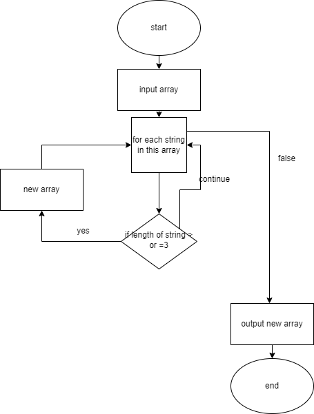

# Блок схема задачи и описание решения

<b>
Конечная цель этого проекта - написать программу, которая из имеющегося массива строк формирует новый массив строк, содержащий только те строки, длина которых меньше или равна 3 символа. Вы можете ввести первоначальный массив строк вручную или задать его в начале выполнения программы.
Чтобы запустить программу, вы можете использовать любую среду разработки на языке программирования, который вы выберете, либо запустить ее из командной строки. После запуска, программа запросит ввод исходного массива строк и затем выведет новый массив, содержащий только короткие строки.

</b>
